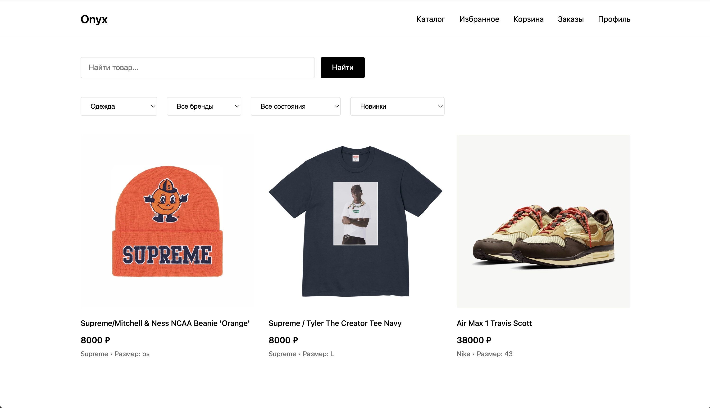
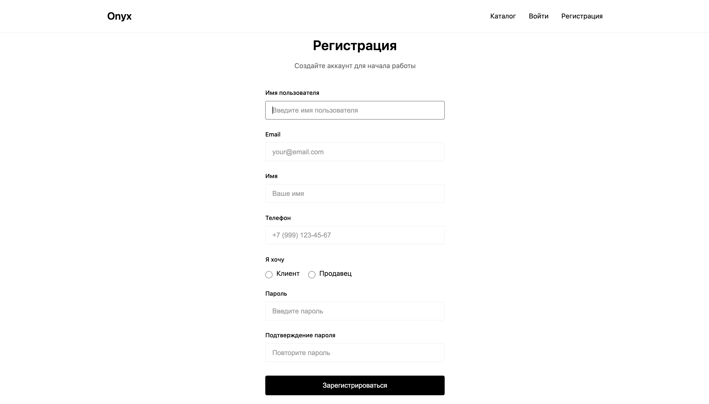
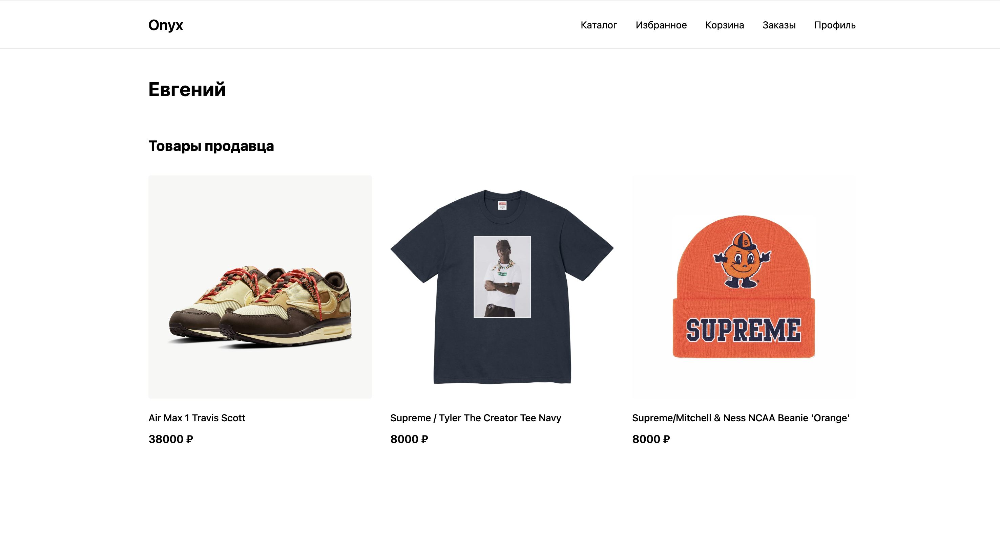
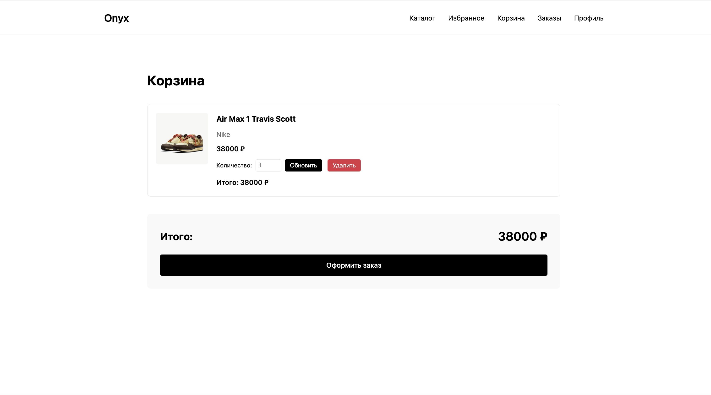
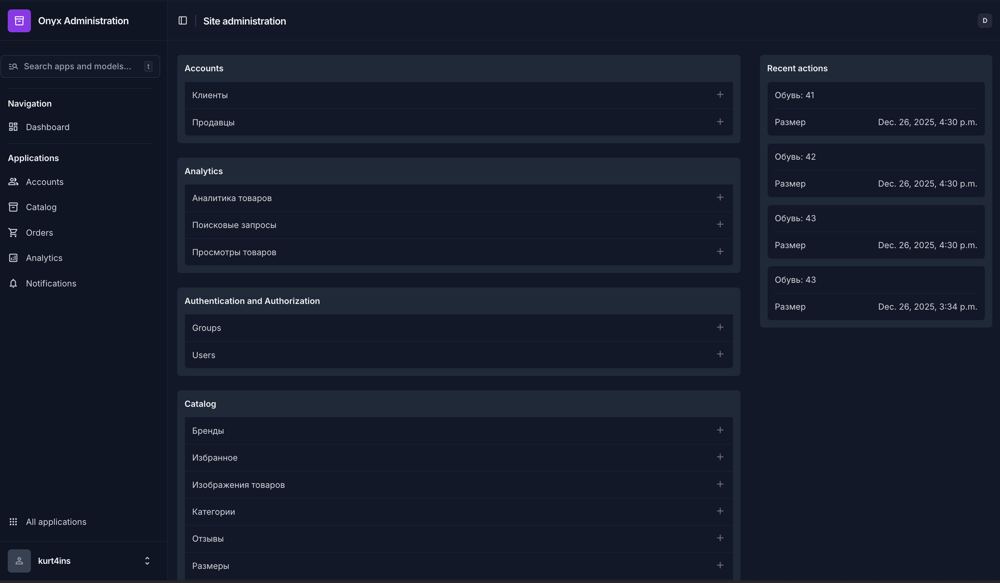
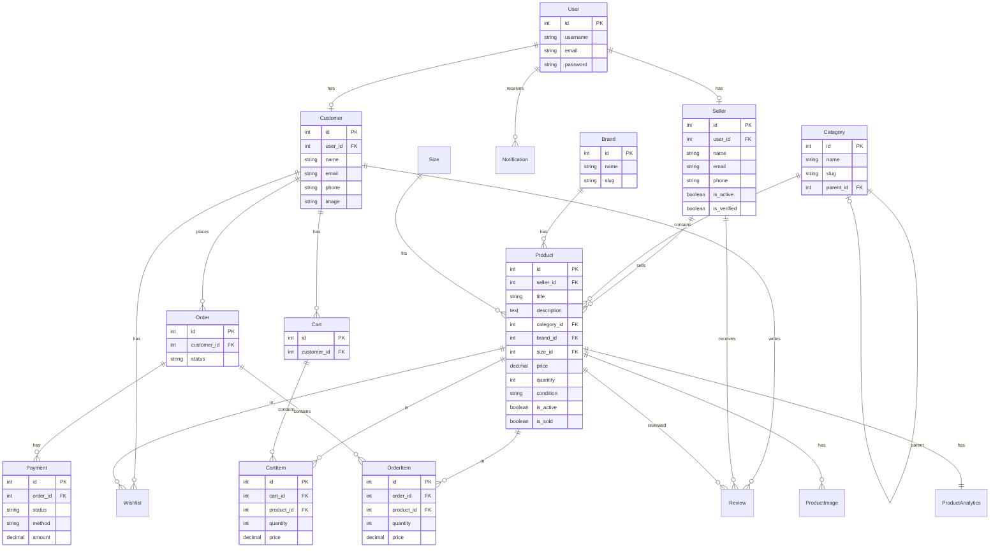
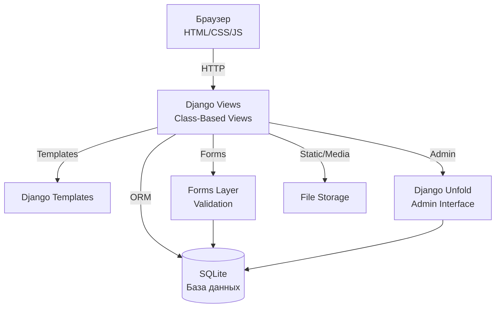

# Onyx
**Onyx** — это веб-приложение, платформа для продажи и покупки товаров. Пользователи могут регистрироваться как клиенты или продавцы, просматривать каталог товаров, добавлять товары в корзину и избранное, оформлять заказы, а продавцы могут управлять своими товарами и отслеживать статистику.

Сервер построен на Django с использованием современного админ-интерфейса Django Unfold, обеспечивающего удобное управление контентом и данными.

## Функции

### Для клиентов:
- Регистрация и авторизация с выбором роли (клиент/продавец) и загрузкой аватара
- Просмотр каталога товаров с фильтрацией по категориям, брендам и условию
- Поиск товаров по названию, описанию и бренду
- Добавление товаров в избранное
- Корзина покупок с возможностью изменения количества товаров
- Оформление заказов с выбором способа оплаты
- История заказов с детальной информацией
- Просмотр публичных страниц продавцов

### Для продавцов:
- Личный кабинет продавца с дашбордом и статистикой
- Управление товарами (создание, редактирование, удаление)
- Загрузка нескольких изображений для каждого товара
- Автокомплит при выборе категорий и брендов
- Создание и управление справочниками (бренды, категории, размеры)
- Статистика продаж по категориям, брендам и месяцам
- Публичная страница продавца с товарами и отзывами

### Общие функции:
- Нормализация телефонных номеров в формат +7XXXXXXXXXX
- Вход по email или телефону
- Аналитика просмотров товаров и поисковых запросов
- Система уведомлений
- Современный админ-интерфейс с Django Unfold

## Стек технологий
- **Backend:** Python 3.14+, Django 6.0+
- **Database:** SQLite
- **Admin:** Django Unfold 0.74.1+
- **Frontend:** HTML, CSS, JavaScript
- **Image Processing:** Pillow 12.0+

## Установка

1. **Клонируйте репозиторий**
   ```bash
   git clone https://github.com/kurt4ins/onyx-resale
   cd onyx
   ```

2. **Установите зависимости с помощью uv**
   ```bash
   uv sync
   ```

3. **Создание .env файла**
   > Создайте файл `.env` в корне проекта с необходимыми переменными:
   ```
   SECRET_KEY=<ваш-секретный-ключ>
   DEBUG=True
   ```

4. **Примените миграции**
   ```bash
   python manage.py migrate
   ```

5. **Создайте суперпользователя (для доступа к админке)**
   ```bash
   python manage.py createsuperuser
   ```

6. **Соберите статические файлы (опционально)**
   ```bash
    python manage.py collectstatic --noinput
   ```

7. **Запустите сервер разработки**
   ```bash
   python manage.py runserver
   ```

8. **Откройте приложение**
   - Перейдите в браузере по адресу `http://127.0.0.1:8000/`
   - Админ-панель доступна по адресу `http://127.0.0.1:8000/admin/`
   - Создайте новый аккаунт или войдите под суперпользователем

## Скриншоты

- Главная страница (Каталог товаров)


- Регистрация


- Профиль продавца


- Корзина


- Админ-панель


## Схема базы данных


## Архитектурная схема


## Структура проекта

```
onyx/
├── apps/
│   ├── accounts/          # Управление пользователями (клиенты и продавцы)
│   ├── catalog/           # Каталог товаров, категории, бренды
│   ├── orders/            # Корзина, заказы, платежи
│   ├── analytics/         # Аналитика просмотров и поисков
│   └── core/              # Базовые функции (уведомления)
├── templates/             # HTML шаблоны
├── docs/                  # Документация 
├── staticfiles/           # Статические файлы
├── media/                 # Загруженные пользователями файлы
└── onyx/                  # Настройки проекта Django
```
